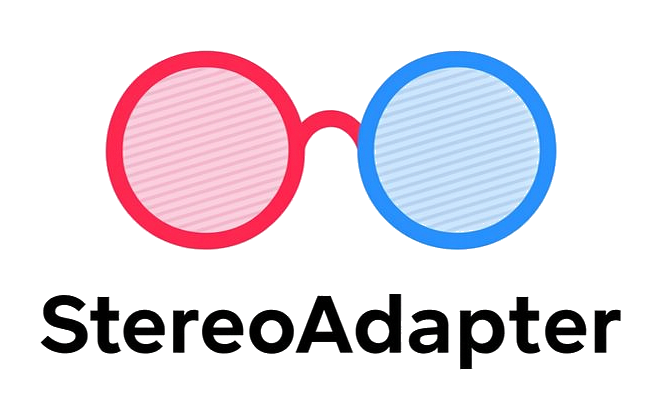

#  StereoAdapter: Adapting Stereo Depth Estimation to Underwater Scenes

This is the official repository for the paper:
> **StereoAdapter: Adapting Stereo Depth Estimation to Underwater Scenes**
>
> Zhengri Wu1* · [Yiran Wang](https://github.com/u7079256)1* · Yu Wen1* · [Zeyu Zhang](https://steve-zeyu-zhang.github.io/)2*† · Biao Wu3 · [Hao Tang](https://ha0tang.github.io/)2‡  
> 1Australian Centre for Robotics 2Peking University 3Australian Artificial Intelligence Institute  
> *Equal contribution. †Project lead. ‡Corresponding author: bjdxtanghao@gmail.com.
>
> ### Paper (coming soon) | [Website](https://aigeeksgroup.github.io/StereoAdapter/) | [Code](https://github.com/AIGeeksGroup/StereoAdapter)

> [!NOTE]
> 💪 This visualizations brief introduce and show the real world deployment of StereoAdapter.

https://github.com/user-attachments/assets/7c3c656c-ea00-4b7c-8f24-f4294b84628f

